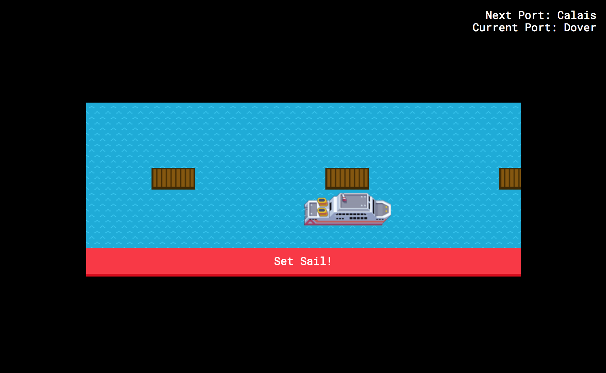

## Cruise Ships :ship:

There's a lot more to a smooth cruise ship operation than just sailing a ship. Ships dock at different ports based on a travel itinerary. These ports can only take so many ships at a time. Did we mention that these cruise ships are operated by the _British_!? They'll refuse to sail in even the tamest weather conditions.

 Replete with a lovely shiny oceanic layer on top of the existing code so everybody can play with cruise ships.